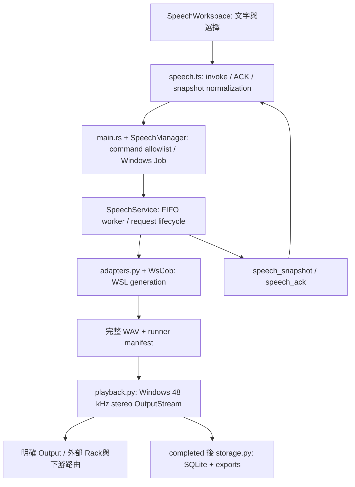

# Agent 維護、調適與除錯手冊

**文件邊界：**本頁只負責 Desktop／Manual TTS 跨層修改、協定、程序所有權、測試入口和除錯，不作人類操作手冊或實測成績單。先讀[專案規則](../rules/project.md)與[快速地圖](agent-quick-map.md)定位 owner；使用者步驟看[Desktop 手冊](../../docs/guides/desktop-user-guide.md)，逐檔用途按路徑查[檔案索引](project-file-map.md)，實測結果看[Manual TTS 驗證](../../docs/verification/desktop/manual-tts-verification-latest.md)。

## 1. 先確認範圍與權威來源

```powershell
Set-Location D:\AetherTune
git status --short --untracked-files=all
git log -1 --format="%H %s"
```

保留既有變更。Orchestration 改在 `app/`、`contracts/`、`services/`；現有推論入口留 `tools/`，第三方 source 留 ignored `tools/external/`。不要把修復直接寫進 upstream／Plugin cache／venv，或自行建立另一套相同功能服務。

| 問題 | 先讀／修改位置 | 檢核入口 |
|---|---|---|
| Composer、IME、Queue 顯示、Mini | `app/src/components/SpeechWorkspace.tsx`、`main.tsx`、`style.css` | `app/tests/manual-tts.mjs`，Browser 目視 |
| ACK 拒絕被誤當成功、object error | `app/src/services/speech.ts` → Rust speech_manager | manual UI negatives、Rust bridge fixture |
| Queue 次序／policy／Stop／Clear | `services/tts/service.py` | `services/tts/test_service.py` |
| Reference／Engine／runner argv | `contracts/voices/`、`contracts/engines/`、`services/tts/adapters.py` | contracts → service → 真實音訊／hash verifier |
| 生成卡住／取消後有 Linux process | `services/tts/wsl_job.py`、`adapters.py`、job logs | ownership tests、實際 cancel probe、PID audit |
| WAV 有聲但沒有播放 | `services/tts/playback.py`、route／PortAudio endpoint | WAV replay diagnostic → real TTS CABLE capture |
| Transcript／Settings／Favorites 不見 | `services/tts/storage.py`、SQLite／exports | storage fixtures、artifact verifier |
| Tray／視窗／全域快捷鍵／App Exit | `app/src-tauri/src/main.rs`、process_manager | Rust lifecycle、native UI／Exit 驗證 |
| VC（Seed／Mean／X）的 Start／Stop | Rust engine_manager → `services/engines/runner_service.py` | runner／cache negatives、desktop probe／engine tests |
| backend 的實際模型推論 | 對應 `tools/*-infer.py`／`*-run.*` 與 `backends/<name>/README.md` | 指定 backend 的真實 WAV／runtime manifest |

最新可重跑 artifact／verifier 優先於報告文字；報告文字優先於單純檔案存在或 UI 色點。`app-verification-latest.md` 保留首次 M0/M1/M2 歷史，Manual 增量以 [manual-tts-verification-latest.md](../../docs/verification/desktop/manual-tts-verification-latest.md) 為準。集中表只是導航，不覆蓋分項結果。

## 2. 呼叫關係與程序所有權



- React／IPC 只傳文字、選擇與 metadata，不傳 PCM，不提供任意 executable／shell command。
- Rust `SpeechManager` 懶啟動 Windows Seed Python：`-u -B -m services.tts.service --root <root>`。初始 snapshot 最多等 30 秒；action ACK 最多等 5 秒。ACK timeout 不等於一定沒有接受，先查 Queue，避免再送一次。
- Python service 只有一個 worker，生成與播放依序完成，不並行跑兩個 request。`TTSOrchestrator` 是 `SpeechService` 的別名，Queue 目前是同一服務內的 deque，沒有另一個隱藏程序。
- 每個 generation 由 WSL `Ubuntu` 的 `setsid --wait` 啟動自有 process group。取消使用 job-local token／PID record／cancel script 驗證身分；不得改成全域 `pkill python`／`taskkill /IM python.exe`。
- Windows Job 管理 Windows 衍生程序；**不能證明 Linux group 已退出**。Stop 的 group audit 與退出後的 process audit 都要保留。
- VC 與 TTS 有分開 manager，Rust 的 `audio_control` mutex 與 active／blocked 檢查防止交疊啟動。`Ctrl+Alt+V`／Tray toggle 仍是 VC runner 操作，不是 TTS shortcut。
- App Exit 先送 TTS shutdown，再等 Windows Job（TTS grace 12 秒），然後 stop VC。一般 VC Stop grace 為 3 秒。隱藏視窗沒有執行這個 Exit 路徑。

## 3. 契約、command 與狀態

前端呼叫 Tauri `speech_status`／`speech_action`；Rust 為每個 action 補 `command_id`。stdin／stdout 是每行一個 JSON。範例是協定說明，不要求使用者另開一個 service 與 App 同時發聲：

```json
{
  "action": "submit",
  "enqueue": false,
  "request": {
    "source": "manual",
    "text": "今天先測試文字模式。",
    "engine_id": "cosyvoice",
    "voice_profile_id": "official-cosyvoice-sample",
    "metadata": {
      "input_source": "manual_text",
      "route": {
        "output": "CABLE Input (VB-Audio Virtual Cable)",
        "host_api": "Windows DirectSound",
        "rack_profile_id": "seed-vc-neutral",
        "route_profile_id": "seed-vc-virtual-route"
      }
    }
  }
}
```

`enqueue=false` 是 Speak 的 policy 路徑；`enqueue=true` 是 Add to Queue，固定 FIFO。`id`／`session_id`／created_at 由 service 產生，前端提交的草稿不等於完整 durable SpeechRequest。priority 保存 metadata，現在不據此排序；不能自行當成 priority queue。

service 的 source 是 manual／stt／system／agent；agent 現在一律拒絕。stt 只接受 metadata.capture_source=physical_microphone，這是來源標記的 validation gate，不是已實作 physical capture 或已排除回授的證明。UI 的 Input Mode 是 microphone／manual_text／agent_reply；Manual Composer 在任何可編輯模式下仍送 source=manual，不能將這兩組 enum 混在一起。

| action | 主要欄位／含意 |
|---|---|
| `submit` | request、enqueue；engine／profile／route／source／policy 先驗證 |
| `stop_speaking` | 只取消 current |
| `clear_queue` | 只取消 pending |
| `remove`／`move_up`／`move_down`／`speak_now` | `id` 必須是 pending request |
| `settings` | `settings.interrupt_policy`、`settings.enter_to_send` |
| `favorite` | `text`、`pinned` |
| `status` | 要求 snapshot／目前 state |
| `shutdown` | 僅 Rust Exit／service close；不是前端一般 action allowlist |

accepted ACK 是提交成功，不是播放完成。事件為 `speech_ack`（accepted／result 或 error object）及 `speech_snapshot`（snapshot）。`speech.ts` 必須把 error object 正規化為可顯示字串，拒絕時保留 Composer；不能將 exception 吞掉並假回 accepted。

| TTS service state | request status／含意 |
|---|---|
| IDLE | 沒有 current／pending；service 可以仍在執行 |
| QUEUED | 有待處理 request |
| GENERATING | current=generating，WSL 模型生成 |
| BUFFERING | current=ready，完整 WAV 已可用，尚未完成播放 |
| PLAYING | current=playing，OutputStream 播放 |
| STOPPING | 已要求 current 取消，等待生命週期收尾 |
| ERROR | 失敗／blocked；普通 backend error 可處理下一句，cleanup／native open 未驗證則停住 pending |

request 正常順序 `queued → generating → ready → playing → completed`；取消與失敗終點為 `cancelled`／`failed`。current 必須以 `current_request_id` 判定，不能把 ready 誤當可以 Remove 的 pending。Terminal history 不計入 active queue 數。TTS 不使用 backend-state 的 READY／RUNNING／OFFLINE 語彙；兩份 schema 不要混用。

Rust snapshot 額外帶 `service_alive`／`service_pid`，不是 Python tts-state schema 的欄位；artifact verifier 移除 native health 欄位後才驗服務 schema。`audio_blocked` 是 service 的安全停機旗標，即使 current 已 cancelled，也要阻止新 Output／VC。

## 4. Voice、Engine 與參數怎麼改

### 修改或新增 Voice profile

1. 核對 reference 音訊來源／可用範圍，保持 [dataset/manifests/reference-register.csv](../../dataset/manifests/reference-register.csv) 與必要 provenance 一致，不存私人授權資料／credentials。
2. 參照 `contracts/voices/reference-female.json`，提供唯一 id、name、engines、references（每個 engine 的 audio_path／text_path）及審核狀態。CosyVoice／Breeze 的 prompt text 可以不同；必須對應 reference 的逐字內容。
3. 在 root-relative 路徑放已準備資產；WAV 不加入 Git。DRAFT／WAITING 不能自行升為人類通過。
4. service 的 profile catalogue 在啟動時讀取；正常 Exit／重開才載入修改。UI 的 Browser fallback 三個 profile 是 `speech.ts` 的靜態 imports，新增項目若要在 preview 出現也需同步；native 正式 catalogue 以 service snapshot 為準。
5. contracts／service tests 通過後，跑真實生成，檢查 runner prompt hash 等於所選 reference、輸出非零、播放與 provider，再另做人工聽評。

每個 accepted request 保存 profile／route／policy metadata 快照，修改下拉選擇只影響新 request。但 reference 路徑指向的檔案不是逐 request 複製鎖定：有 current／pending 時不要覆寫 reference 或模型內容。Voice ID 切換 PASS 是 reference 契約切換證據，不等於聲線相似度通過。

### 調整參數或新增 Engine

目前 UI 支援兩個 TTS Engine。新增 manifest **不足以**啟動新 engine；還需要 service `ALLOWED_ENGINES`、`default_adapters()`、實際 adapter／runner、profile 支援、UI `supportedEngines`／型別與 tests。不要把 TTS 掛到只允許 Seed／Mean／X 的 VC bridge，或把 CosyVoice3 標成 installed。新增 backend 還需按 AGENTS 更新所有入口／register。

CosyVoice2 adapter 使用既有 zero-shot runner、fp16 與離線 cache env。Breeze adapter 支援 metadata 的 `instruction`、`cfg_scale`、`seed`、`fast_all`、`attention_implementation`；目前 UI 不送這些控制欄位，實際預設為 cfg=1、seed=42、fast_all=false、eager。manifest parameter 不能被當作 UI 已送值的證明。要補控制項，從 UI payload、validation、adapter argv 到 runner evidence 都核對，且新增非預設值回歸。

`supports_streaming_tts=false` 是現在 adapter 的能力。若補 streaming／warm residency，需同時改 buffer／取消／播放生命週期與首包 metrics，不能只把 manifest flag 改 true。修改基本延遲來源時，保留舊 evidence 並產生新 run。

## 5. 存放位置、持久化與 metrics

| 檔案／資料 | 權威／使用方式 |
|---|---|
| `artifacts/tts/tts.sqlite3` | canonical DB；tables：sessions、speech_requests、transcripts、recent_phrases、favorites、tts_settings |
| `artifacts/sessions/<id>/session.json` | session 起／迄時間與 export metadata |
| 同目錄 `requests.jsonl` | 每個 request 的 durable status／profile／route／metrics；不是已發聲清單 |
| `transcript.jsonl`／`transcript.txt` | completed playback 的 export；history GUI 尚未實作 |
| `<request-id>.evidence.json` | runner manifest、model full-hash fingerprint、output hash、PID audit、route resolution |
| `jobs/<request-id>/` | WAV、runner JSON、tts-text.txt、launch.sh、cancel.sh、wsl-pid.json、stdout.log、stderr.log、cancel.log／marker（有取消時） |
| `export_error.json` | export failure 的補充診斷；先查 canonical DB |
| `artifacts/desktop/shell.json` | native Overlay 外觀／hotkeys；restart 不恢復 click-through／quick popup |
| WebView sessionStorage | Composer／Input／profile UI 暫存；不是 DB 或可靠跨 process 備份 |

同一 TTS service 共用一個 session；Input／Voice／Engine 切換不重建。新服務產生新 session，未自動從 DB 重建 pending。Recent／Favorites／settings 跨 session 保存，但 UI Transcript 只讀 current session。不要為了清畫面就刪 DB／整個 artifacts。

只有 `record_completed()` 寫 Transcript，manual 為 source_type=self、provider／transcript_provider=manual_text、speech_status=completed。queued／cancelled／failed 無已發聲 Transcript。若播放後 storage 失敗，request 仍 completed 並有 TRANSCRIPT_STORAGE_FAILED；不能把它改 failed 然後自動重播。

五個時間欄位在 `request.metrics`：request_created_at、generation_started_at、first_audio_at、playback_started_at、playback_completed_at。first_audio_at 現為完整 WAV 可用的時刻，不是 first playback callback；後者另存 first_playback_audio_at。TTFA=first_audio_at−created，total=completed−created，都含 queue 等待。generation_latency_ms 由 adapter 執行時間計算；model fingerprint 等後續準備可能使它不等於 generation_started_at→first_audio_at。不要混用這些數字推導 streaming latency。

generated WAV 常為 24 kHz mono；播放 adapter resample 至 48 kHz stereo。route_status=WAITING、playback_verified=false 保留完整 rack／外部路由 gate；外部 verifier 的指定 CABLE 非零擷取 PASS 不會自動改這兩欄。

## 6. 除錯順序與 error 分層

先記下實際操作、文字、Engine／Voice、Output／Host API、session／request ID，保留本次 evidence，再處理問題。不要使用舊 WAV 或舊 PASS JSON 補當次失敗。

| error／現象 | 所在層／檢查 | 恢復邊界 |
|---|---|---|
| REQUEST_INVALID／QUEUE_BUSY／REFERENCE_INVALID | service validation、profile 支援、request payload；未 accepted 不建立有效新工作 | 修資料或policy再送，草稿保留 |
| MODEL_NOT_FOUND／BACKEND_UNAVAILABLE／ENV_PROBE_TIMEOUT | engine requiredPaths、WSL Ubuntu／venv executable、source／model presence | 補正本機環境，Exit 重開更新 catalogue／preflight cache |
| TTS_SERVICE_TIMEOUT／UNAVAILABLE | Rust initial snapshot、Windows Seed Python、startup import／audio init | 查本次 service／初始化，正常 Exit；不能報「backend ready」 |
| TTS_CONTROL_TIMEOUT | Rust ACK 5 秒期限；command 可能已接受 | 先查 Queue，不盲目重送 |
| BACKEND_CRASH／PARAMETER_INVALID | WSL job stdout／stderr／runner manifest、argv與參數 | 普通 failed request 留 evidence，下一句可繼續 |
| DEVICE_NOT_FOUND／ROUTE_FAILED | exact endpoint／Host API／48k stereo、WAV finite／nonzero／callback | 修 route；不要落到系統 default |
| PLAYBACK_OPEN_TIMEOUT／AUDIO_BLOCKED／AUDIO_INIT_FAILED | native driver open／init、安全旗標 | 暫停 pending／新 submit／VC；Exit 重啟，不能繞過旗標 |
| CANCEL_CLEANUP_FAILED／SERVICE_BLOCKED | ownership token／Linux group cleanup unverified | 停止新工作、正常 Exit、audit 所有本輪 PID／group |
| TRANSCRIPT_STORAGE_FAILED／export_error.json | SQLite transaction／exports | 保存音訊已播完事實，修持久化／重建export，不重播 |

有生成 WAV 時先查 [tools/wav-evidence.py](../../tools/wav-evidence.py) 或本次 runner JSON，確認 hash／非零。若生成沒問題而 PLAYING 阻塞，使用 playback diagnostic 重播現有短 WAV；那只證明 adapter，不算新的模型 inference。不要在同一 CABLE／GPU 上同時啟動多個實測。

## 7. 可重跑檢核與證據邊界

### 快速 regression（不重新跑 20 次模型）

```powershell
Set-Location D:\AetherTune
& .\app\dev.ps1 -Test
# TTS 單獨測試：
& .\tools\venvs\seed-vc\Scripts\python.exe -m unittest services.tts.test_service -v
```

`dev.ps1 -Test` 跑 contracts、runner／cache fixtures、TTS lifecycle／storage／ownership 及 Rust lifecycle。它含真實短 WSL ownership fixture，但不生成模型聲音，不代表 GUI／CABLE PASS。

UI 改動用兩個終端：第一個 `Set-Location D:\AetherTune\app` 後 `npm run dev`；第二個在同目錄跑 `npm run test:ui`、`npm run test:manual-tts-ui`。後者是 explicit mocked Tauri IPC，配合內建 Browser／Chrome 複核畫面，按 AGENTS 記錄 URL、viewport、actions、console／network、screenshots。native layer 未測就明列 WAITING。純文件改動只檢查連結、檔案覆蓋、指令與 source 一致，不重跑模型或錄音。

原生 WebView2 測試需當次 App PID，不能拿舊 PID 或只依瀏覽器預覽。只在測試 shell 設定 CDP port；啟動時隱藏視窗，測試後用受控 Exit 回收本輪程序：

```powershell
Set-Location D:\AetherTune\app
$env:WEBVIEW2_ADDITIONAL_BROWSER_ARGUMENTS = '--remote-debugging-port=9223'
$appProcess = Start-Process .\src-tauri\target\debug\aethertune-desktop.exe -WindowStyle Hidden -PassThru
$env:AETHERTUNE_CDP = 'http://127.0.0.1:9223'
npm run test:ui
node tests/engines.mjs
if (-not $appProcess.HasExited) { .\tests\cleanup.ps1 -AppProcessId $appProcess.Id }
Remove-Item Env:AETHERTUNE_CDP,Env:WEBVIEW2_ADDITIONAL_BROWSER_ARGUMENTS -ErrorAction SilentlyContinue
```

`cleanup.ps1` 只接受本專案 Desktop build 的 PID，並核對其 owned process tree；每輪重取 PID，不能拿上一輪的值。CDP／Playwright、內建 Browser／Chrome 的測試範圍要分開回報，沒有實際 native 畫面及音訊 evidence 就保持相應 `WAITING`。

### 正式 Rust manager → 真實模型 → CABLE

先 build probe，成功完成後才執行，不要讓上一個 probe 活著時覆蓋 exe：

```powershell
Set-Location D:\AetherTune
$env:CARGO_HOME = 'D:\AetherTune\artifacts\desktop-toolchain\cargo'
$env:RUSTUP_HOME = 'D:\AetherTune\artifacts\desktop-toolchain\rustup'
& "$env:CARGO_HOME\bin\cargo.exe" build --manifest-path app\src-tauri\Cargo.toml --bin speech-probe
if ($LASTEXITCODE -ne 0) { throw 'speech-probe build failed' }
$ttsPython = '.\tools\venvs\seed-vc\Scripts\python.exe'
$ttsEvidenceDir = 'artifacts\desktop\manual-tts-audio\manual-' + (Get-Date -Format 'yyyyMMdd-HHmmss')
if (Test-Path -LiteralPath $ttsEvidenceDir) { throw 'Evidence folder already exists' }
& $ttsPython app\tests\manual-audio-smoke.py --engine cosyvoice --voice official-cosyvoice-sample --output $ttsEvidenceDir
if ($LASTEXITCODE -ne 0) { throw 'Manual audio smoke failed; retain evidence' }
Push-Location app
try {
    node tests\verify-speech-artifacts.mjs "..\$ttsEvidenceDir\probe.jsonl"
    if ($LASTEXITCODE -ne 0) { throw 'Speech artifact verification failed' }
} finally { Pop-Location }
& $ttsPython app\tests\audit-speech-processes.py "$ttsEvidenceDir\probe.jsonl"
if ($LASTEXITCODE -ne 0) { throw 'Owned process audit failed' }
```

每輪換未使用的 output 資料夾，避免覆寫現有 evidence。單輪完成＋audit 後才啟下一輪。腳本只捕獲 CABLE Output／DirectSound 48k stereo，不讀實體 Mic／final mixed output。產物是 probe.jsonl、audio-report.json、cable-loopback.wav，再由 verifier／audit 產生兩個報告。它核對本輪記錄的 PID／group，不是全機程序掃描。

其他情境只替換 smoke 命令的參數：

| 情境 | 額外參數 |
|---|---|
| Breeze 單次 | `--engine breeze --voice reference-female` |
| 生成取消與 recovery | `--count 2 --cancel-after 5` |
| 已出聲的播放取消 | `--count 2 --cancel-on-playing`；PLAYING 1 秒後 Stop，需取消前非零 capture 時窗 |
| 20 次 FIFO／Voice switch | `--voice reference-female,reference-male --count 20 --text-file app\tests\fixtures\manual-queue.txt` |

不在沒有改動／異常時無理由重跑 20 次。下列層級分開回報：contract／fixture PASS、實際 generation WAV PASS、指定 playback／capture PASS、physical Mic／rack／LIVE／聽評。下載、import、CUDA available、模型存在、HTTP 200、GUI 開啟都不能單獨證明後面的層級。

## 8. 文件與交接維護

新增／刪除／更名檔案時同步 [project-file-map.md](project-file-map.md) 的逐檔連結。操作改變同步操作手冊；協定／ownership 改變同步本手冊與 app architecture／schemas；實測狀態改變更新對應 verification 與集中狀態，附命令、hash、device、artifact、限制。驗證報告只記該輪事實，不替所有新機背書。

完成交接提供：改動檔案、session／request／run ID、真實 artifact 路徑、測試命令及結果、剩餘 WAITING／PLANNED。Git 僅提交 approved source／contracts／tests／docs，不能包含 `.venv`／weights／聲音／私人資料；推送須依既有使用者授權，精確 stage 後比對 local／tracking／remote SHA。
