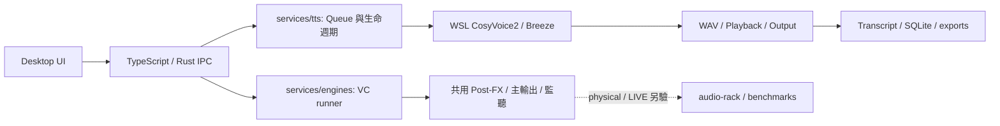

# AetherTune Agent 快速地圖

**文件邊界：**本頁只做開發任務的**一頁式 owner 導航**。先讀[專案規則](../rules/project.md)，再定位 owner、該模組契約與對應 verification；跨層關係才開[維護手冊](agent-maintenance-guide.md)，逐檔用途才在[完整檔案索引](project-file-map.md)搜尋路徑。按任務找文件用[文件入口](../../docs/README.md)，不要為單一修改載入整份索引或所有 `docs/`。

## 一眼看資料流



Manual TTS 目前先產生完整 WAV 才播放，不能把它當作即時聲音鏈路。Streaming VC 與 Speech Reconstruction 是不同路線；共用 audio-rack 與 benchmark 契約不代表完整 LIVE 已通過。

## 任務 → owner → 最小驗證入口

| 任務 | 先看這裡 | 再看／檢核 |
|---|---|---|
| 看需求／目前進度、接續優化工作 | [功能規格](../../docs/specs/app-requirements.md)、[任務進度](../../docs/status.md)的單一 F／任務 ID | [交接流程](agent-maintenance-guide.md#task-handoff)；不要把歷史 M 編號當完成順序 |
| UI／TTS 解耦、共用 DSP、資料 migration／效能 | [模組邊界](../../docs/specs/app-architecture.md#modular-boundaries)、[資料 owner](../../docs/specs/app-architecture.md#data-ownership)及任務列中的 source | [優化驗收](../../docs/specs/verification-plan.md#optimization-acceptance)；先 baseline，保持公開契約 |
| 使用者操作、文案、視窗可見行為 | `app/src/components/SpeechWorkspace.tsx`、`app/src/main.tsx`、`app/src/style.css` | [Desktop 操作手冊](../../docs/guides/desktop-user-guide.md)、`app/tests/manual-tts.mjs` |
| Speak／Queue 的前端 ACK 與 snapshot | `app/src/services/speech.ts` | `app/src-tauri/src/speech_manager/mod.rs`、`app/tests/manual-tts.mjs` |
| Native command、Tray／Exit、程序清理 | `app/src-tauri/src/main.rs`、`app/src-tauri/src/speech_manager/mod.rs`、`app/src-tauri/src/process_manager/mod.rs` | `app/src-tauri/` tests、[維護手冊](agent-maintenance-guide.md) |
| Queue、取消、狀態轉移、Transcript 寫入時機 | `services/tts/service.py` | `services/tts/test_service.py`、[Manual TTS evidence](../../docs/verification/desktop/manual-tts-verification-latest.md) |
| 快照排序、request／profile 公開欄位及複製隔離 | `services/tts/snapshot.py`（純投影） | `services/tts/test_snapshot.py`、service 回歸；[快照模組驗證](../../docs/verification/desktop/performance-baseline-latest.md#snapshot-projection-module) |
| request 欄位、來源／profile／policy 驗證 | `services/tts/validation.py`（純資料；route／FX validator 注入） | `services/tts/test_validation.py`、service ACK／拒絕回歸；[請求驗證拆分](../../docs/verification/desktop/manual-tts-verification-latest.md#request-validation-module) |
| Engine／Voice profile／reference 選擇 | `contracts/engines/`、`contracts/voices/`、`services/tts/adapters.py` | 對應 manifest／hash、真實輸出 WAV |
| WSL 啟動與取消的程序所有權 | `services/tts/wsl_job.py` | job log、取消測試、`app/tests/audit-speech-processes.py` |
| Windows 播放與輸出裝置 | `services/tts/playback.py` | Output endpoint、CABLE capture、[Manual TTS evidence](../../docs/verification/desktop/manual-tts-verification-latest.md) |
| Session、Favorites、SQLite、exports | `services/tts/storage.py` | storage tests、`app/tests/verify-speech-artifacts.mjs`；[隔離資料 baseline](agent-maintenance-guide.md#storage-baseline) |
| 四 VC 的 runner 與 CLI | `services/engines/stream_runtime.py`、`streaming_adapters.py`、`rvc_runtime.py`、對應 `backends/<name>/README.md` | [Desktop VC](../../docs/verification/desktop/realtime-vc-verification-latest.md)、[CLI backend 實測](../../docs/verification/backends/backend-install-test-latest.md) |
| Desktop 圖形入口與建置 | 根目錄 `AetherTune.exe`（build 產物）、`app/dev.ps1` | [Desktop 手冊](../../docs/guides/desktop-user-guide.md)、[App 實測](../../docs/verification/desktop/app-verification-latest.md) |
| Audio Rack、路由、LIVE 分類 | `audio-rack/`、`benchmarks/`、[LIVE gate](../../docs/specs/live-gate.md) | 對應實際 artifact；不要由檔案存在推論 PASS |
| 未來 Mic／Agent Reply 擴充 | [需求](../../docs/specs/app-requirements.md)、[架構](../../docs/specs/app-architecture.md)、`contracts/` | 先定輸入權限／來源證據；現況 `WAITING`／`PLANNED` |

## 只展開需要的部分

```powershell
Set-Location D:\AetherTune
git status --short --untracked-files=all
rg -n 'SpeechWorkspace|services/tts/playback.py' .agent/reference/project-file-map.md
rg --files services/tts
```

找到 owner 後，讀該檔與直接相依的契約，再讀相關驗證。變更若跨層，沿 **UI → IPC → service → adapter／playback → storage** 檢查 payload、錯誤與生命週期；不要只改畫面文字就宣稱後端行為已改。新增、刪除、更名 Git 管理檔案時更新[逐檔索引](project-file-map.md)；變更功能時同步對應操作說明與驗證狀態。

`PASS`、`WAITING`、`PLANNED` 以[集中狀態](../../docs/status.md)定位分項驗證，**實際可重跑 artifact／verifier 優先**。本頁不保存另一份當前狀態表。
