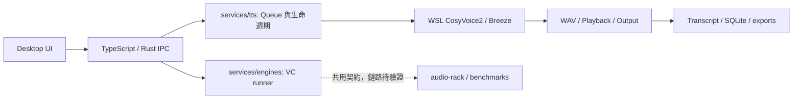

# AetherTune Agent 快速地圖

**文件邊界：**本頁只做開發任務的**一頁式 owner 導航**。先讀根目錄 [AGENTS.md](../AGENTS.md)，再定位 owner、該模組契約與對應 verification；跨層關係才開[維護手冊](agent-maintenance-guide.md)，逐檔用途才在[完整檔案索引](project-file-map.md)搜尋路徑。文件內容權威看[文件地圖](README.md)，不要為單一修改載入整份索引或所有 `docs/`。

## 一眼看資料流



Manual TTS 目前先產生完整 WAV 才播放，不能把它當作即時聲音鏈路。Streaming VC 與 Speech Reconstruction 是不同路線；共用 audio-rack 與 benchmark 契約不代表完整 LIVE 已通過。

## 任務 → owner → 最小驗證入口

| 任務 | 先看這裡 | 再看／檢核 |
|---|---|---|
| 使用者操作、文案、視窗可見行為 | `app/src/components/SpeechWorkspace.tsx`、`app/src/main.tsx`、`app/src/style.css` | [Desktop 操作手冊](desktop-user-guide.md)、`app/tests/manual-tts.mjs` |
| Speak／Queue 的前端 ACK 與 snapshot | `app/src/services/speech.ts` | `app/src-tauri/src/speech_manager/mod.rs`、`app/tests/manual-tts.mjs` |
| Native command、Tray／Exit、程序清理 | `app/src-tauri/src/main.rs`、`app/src-tauri/src/speech_manager/mod.rs`、`app/src-tauri/src/process_manager/mod.rs` | `app/src-tauri/` tests、[維護手冊](agent-maintenance-guide.md) |
| Queue、取消、狀態轉移、Transcript 寫入時機 | `services/tts/service.py` | `services/tts/test_service.py`、[Manual TTS evidence](manual-tts-verification-latest.md) |
| Engine／Voice profile／reference 選擇 | `contracts/engines/`、`contracts/voices/`、`services/tts/adapters.py` | 對應 manifest／hash、真實輸出 WAV |
| WSL 啟動與取消的程序所有權 | `services/tts/wsl_job.py` | job log、取消測試、`app/tests/audit-speech-processes.py` |
| Windows 播放與輸出裝置 | `services/tts/playback.py` | Output endpoint、CABLE capture、[Manual TTS evidence](manual-tts-verification-latest.md) |
| Session、Favorites、SQLite、exports | `services/tts/storage.py` | storage tests、`app/tests/verify-speech-artifacts.mjs` |
| Seed／Mean／X 的 runner 與 CLI | `services/engines/`、對應 `backends/<name>/README.md` | [backend 實測](backend-install-test-latest.md) |
| 舊 Tk 控制台與腳本 | `AetherTune.cmd`、`tools/` | [工具入口](../tools/README.md)、[Python/UI 實測](python-ui-verification-latest.md) |
| Audio Rack、路由、LIVE 分類 | `audio-rack/`、`benchmarks/`、[LIVE gate](live-gate.md) | 對應實際 artifact；不要由檔案存在推論 PASS |
| 未來 Mic／Agent Reply 擴充 | [需求](app-requirements.md)、[架構](app-architecture.md)、`contracts/` | 先定輸入權限／來源證據；現況 `WAITING`／`PLANNED` |

## 只展開需要的部分

```powershell
Set-Location D:\AetherTune
git status --short --untracked-files=all
rg -n 'SpeechWorkspace|services/tts/playback.py' docs/project-file-map.md
rg --files services/tts
```

找到 owner 後，讀該檔與直接相依的契約，再讀相關驗證。變更若跨層，沿 **UI → IPC → service → adapter／playback → storage** 檢查 payload、錯誤與生命週期；不要只改畫面文字就宣稱後端行為已改。新增、刪除、更名 Git 管理檔案時更新[逐檔索引](project-file-map.md)；變更功能時同步對應操作說明與驗證狀態。

`PASS`、`WAITING`、`PLANNED` 以[集中狀態](agent-implementation-status-latest.md)定位分項驗證，**實際可重跑 artifact／verifier 優先**。本頁不保存另一份當前狀態表。
