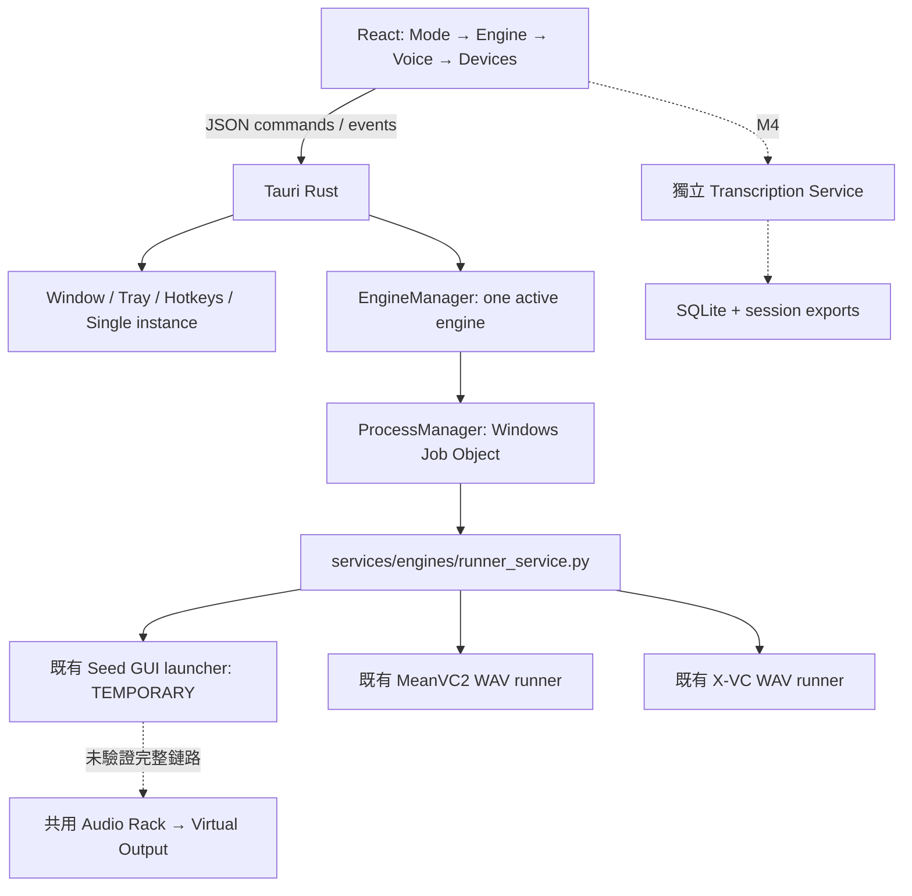

# AetherTune Desktop App — 架構與開發入口

本輪新增 orchestration layer；`backends/`、`tools/`、`models/`、`audio-rack/`、`benchmarks/` 與已驗證 runner 保持原樣。產品基準見 [app-requirements.md](app-requirements.md)。



## 責任與依賴

| 位置 | 責任 |
|---|---|
| `app/src/main.tsx`／`services/desktop.ts` | 三種 layout、capability filtering、明確的 pending UX、Tauri IPC |
| `app/src-tauri/src/main.rs` | 原生視窗、Tray、快捷鍵、single instance、commands、Exit |
| `app/src-tauri/src/engine_manager/` | discover／validate／start／stop／status／logs，串行切換 |
| `app/src-tauri/src/process_manager/` | suspended spawn → assign Job → resume；stdout／stderr；crash／cleanup |
| `services/engines/runner_service.py` | JSONL bridge、參數／reference／端點預檢、受限制的 runner argv |
| `contracts/engines/` | 六個 manifest；只有 Seed／Mean／X 可啟動 |
| `contracts/schemas/` | manifest、state、Transcript、Session 的版本 1 契約 |

沒有把 React 塞到 `tools/`。本輪同一個 Python bridge 接三種 Adapter，避免尚無差異需求時建立三套 service；argv routing 清楚受 engine allowlist 限制，模型仍用各自 venv。之後 headless engine 可以取代對應的 TEMPORARY branch，而不重建 App。

## 程序與狀態語意

Rust 只啟動固定的 bridge 與既有 Python。前端不能指定 executable 或任意 shell command。bridge 的 request 寫入 ignored `artifacts/desktop/control/`；runner 結果進 `artifacts/desktop/runs/<uuid>/`。backend stdout／stderr 轉成 `log` events；每行立即 flush 到 `artifacts/desktop/logs/*.jsonl`，UI 僅保留最近 500 events。

Windows Job 開啟 `KILL_ON_JOB_CLOSE`；service 以 suspended 狀態建立，在 job 指派完成後 resume，衍生 PowerShell／venv launcher／Python 都繼承 job。Stop 先發 JSON command，最多等 3 秒，再 close Job、wait／join 所有 readers。service crash 自動 close Job；App Exit／硬結束由 Rust／OS close handle 清除子程序。只清理 App 自己擁有的 job，不依程序名稱掃殺既有 backend。

切換先 stop 舊 job，再啟動新 job，reader threads join 後才能復用 snapshot。UI 執行中鎖定 Engine 選擇；沒有無縫 hot swap。

`VALIDATING` = 資產、WAV、參數、Seed PortAudio 端點預檢。預檢 PASS 不是 READY；`LOADING` = runner 初始化。Mean 的既有 `Model load seconds:` 可推進 READY → RUNNING（僅 WAV operation）。Seed GUI 沒有模型 readiness ACK，X 沒有結構化 load ACK，保持 LOADING，不用 PID 假造 RUNNING。完成 file runner 後 OFFLINE，但 bridge 需 Stop 才釋放。`audio_verified` 本輪固定 false；不產生 LIVE 或音訊 PASS。

## 控制協定

App → bridge：

```json
{"command":"start"}
{"command":"status"}
{"command":"set_parameter","name":"diffusion_steps","value":10}
{"command":"stop"}
```

非 runtime 可調參數回 `restart_required`，不假稱已套用。完整參數編輯／Presets 留 M3；目前使用 manifest defaults。

bridge → App：state（嚴格七狀態）、validation、artifact、process_started、process_exit、log、error、restart_required。process_started 是程序事件，不是新的 BackendState。非 JSON 行只能作 log。此通道不允許 PCM；STT／Metrics 日後也只傳 metadata。

## Overlay 與逃生入口

Full 1040 × 740、Compact 420 × 490、Mini 420 × 74，使用 logical pixel；Windows 125% DPI 的 physical size 相應放大。Compact／Mini 強制置頂；Full 可以自行選擇置頂。透明 WebView + Overlay CSS surface opacity 0.45–1；Full 維持不透明。標題以 pointer capture 取得 screen 座標差，再由 Rust `move_window` 套用 physical position；原生 drag region 在本機自動化測試未產生位移，因此使用此小型視窗控制替代。Lock Position 同時阻止前端 capture 與 Rust move／drag command；固定 frameless。

Click-through 只適用 Overlay；`Ctrl+Alt+A` 在 click-through 時解除並 show／focus，而非單純 hide。Tray 有 Disable click-through。重啟永遠清除 click-through，避免無法操控。快捷鍵修改先驗證、註冊失敗恢復舊值；外觀／hotkeys 保存 `artifacts/desktop/shell.json`。

瀏覽器預覽無原生能力，Start／Stop、Tray、native settings 按鈕明確停用。`npm run dev` 不是 Tauri 的音訊或程序驗收。

## 開發與驗證入口

需要 Windows WebView2、Visual Studio C++ Build Tools、Rust MSVC、Node/npm；依 [Tauri 官方 prerequisites](https://v2.tauri.app/start/prerequisites/) 準備。本機已有 C++ tools／WebView2，Rust 本輪安裝於 ignored `artifacts/desktop-toolchain/`，不修改系統 PATH。npm 依賴在 `app/node_modules/`，lockfiles 保留固定解析版本；模型／Python venv 沿用原有版本。

```powershell
Set-Location D:\AetherTune\app
npm ci
.\dev.ps1          # Tauri dev + Vite
.\dev.ps1 -Build   # debug exe；不產生 installer
.\dev.ps1 -Test    # M0 contracts + Python adapter negatives + Rust lifecycle
```

本機 build：`app/src-tauri/target/debug/aethertune-desktop.exe`。目前 portable／installer 尚未實作；repo 根路徑預設使用 compile-time checkout，可用 `AETHERTUNE_ROOT` 指向已準備的完整專案。本輪 UI reference／devices defaults 是這台 PC 的 migration 設定，不代表跨機 portability。

可重跑畫面驗證：

```powershell
# 瀏覽器預覽：另一個終端先 npm run dev
npm run test:ui

# 原生 WebView2：只在測試時開本機 debug port，平日不設定此環境變數
$env:WEBVIEW2_ADDITIONAL_BROWSER_ARGUMENTS='--remote-debugging-port=9223'
Start-Process .\src-tauri\target\debug\aethertune-desktop.exe -WindowStyle Hidden
$env:AETHERTUNE_CDP='http://127.0.0.1:9223'
npm run test:ui
node tests/engines.mjs
# UI 檢核會 hide 視窗；用 Tray 或 Ctrl+Alt+A 重新顯示
node tests/exit-running.mjs
.\tests\cleanup.ps1 -AppProcessId <本次測試 App PID>
```

畫面／reports：`artifacts/desktop/ui/`；integration／cleanup：`artifacts/desktop/integration/`。Computer Use／內建 Browser 作獨立目視複核，不能僅依 Playwright。

## 後續架構邊界

M2 下一片完成 headless readiness／start／stop 與 canonical audio devices，再由 M3 產生分級動態控制項與 Preset。Seed GUI branch 明列 TEMPORARY，不宣稱日常 MVP。

M4 的常駐 STT 不掛在 EngineManager job 下；Mic self 與 Remote loopback 分 source。重建使用 backend_stt provider 避免雙重辨識。SQLite transaction 在 completed utterance 後立即 commit，export 可由 canonical DB 重建；Clear View 不刪 DB。GPU 預設保留 VC，STT CPU。

M5 VoiceProfile 與 M6 TTS 共用 Mode → Engine；M7 只接既有 Audio Rack。M8 才處理 bundle resources、backend detection、installer／portable／auto update／startup／settings migration。任何超出此分層的改動先說明，不自行形成平行架構。
