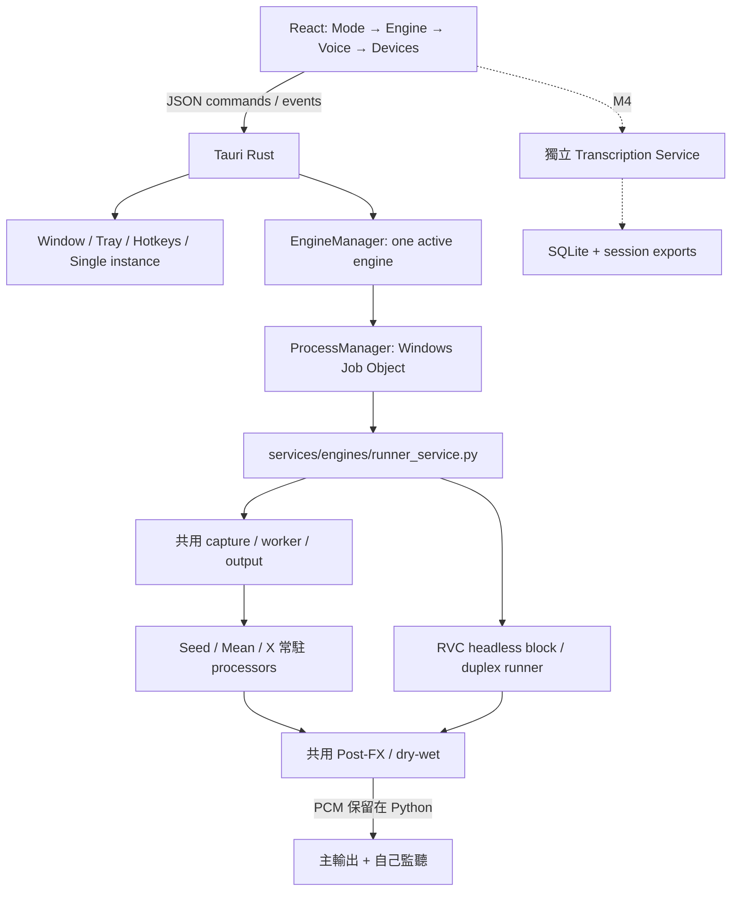

# AetherTune Desktop App — 架構與開發入口

**文件邊界：**本頁只定義 Desktop React／Tauri／Python 的分層、程序生命週期與 IPC 設計。產品預期行為由 [app-requirements.md](app-requirements.md) 擁有；建置、測試與除錯命令由 [agent-maintenance-guide.md](../../.agent/reference/agent-maintenance-guide.md) 擁有；真實結果見對應驗證報告。`backends/`、`tools/`、`models/`、`audio-rack/`、`benchmarks/` 與已驗證 runner 保持各自責任。



## 責任與依賴

| 位置 | 責任 |
|---|---|
| `app/src/main.tsx`／`services/desktop.ts` | 三種 layout、capability filtering、明確的 pending UX、Tauri IPC |
| `app/src-tauri/src/main.rs` | 原生視窗、Tray、快捷鍵、single instance、commands、Exit |
| `app/src-tauri/src/engine_manager/` | discover／validate／start／stop／status／logs，串行切換 |
| `app/src-tauri/src/process_manager/` | suspended spawn → assign Job → resume；stdout／stderr；crash／cleanup |
| `services/engines/runner_service.py` | JSONL bridge、參數／reference／端點預檢、受限制的 runner argv |
| `services/engines/rvc_runtime.py` | 登錄 `.pth/.index`、固定 RVC core、CUDA F0 warmup、rolling buffer／SOLA、Mic／WAV、PortAudio 與監聽 |
| `services/engines/stream_runtime.py` | Seed／Mean／X 共用 capture callback、推論 worker、bounded PCM queue、輸出／監聽、metrics 與 evidence |
| `services/engines/streaming_adapters.py` | 三個常駐模型、reference conditioning、固定 source、48 kHz host block 與各自 rolling cache |
| `services/engines/postfx.py` | 四個 VC 共用 EQ／壓縮／殘響／乾濕混合；關閉時完整 bypass |
| `contracts/engines/` | 六個 manifest；VC 可啟動 Seed／Mean／X／RVC，TTS 另走 speech service |
| `contracts/schemas/` | manifest、state、Transcript、Session 的版本 1 契約 |

同一個 Python bridge 接各 VC Adapter；argv routing 受 engine allowlist 限制，模型用各自 venv。RVC 的 UI 參數從 manifest 呈現、JSON request 傳遞，runner 再驗範圍及 register hash。headless RVC 不啟動上游 GUI、不經 IPC 傳 PCM。

## 程序與狀態語意

Rust 只啟動固定的 bridge 與既有 Python。前端不能指定 executable 或任意 shell command。bridge 的 request 寫入 ignored `artifacts/desktop/control/`；runner 結果進 `artifacts/desktop/runs/<uuid>/`。backend stdout／stderr 轉成 `log` events；每行立即 flush 到 `artifacts/desktop/logs/*.jsonl`，UI 僅保留最近 500 events。

Windows Job 開啟 `KILL_ON_JOB_CLOSE`；service 以 suspended 狀態建立，在 job 指派完成後 resume，衍生 PowerShell／venv launcher／Python 都繼承 job。Stop 先發 JSON command，最多等 3 秒，再 close Job、wait／join 所有 readers。service crash 自動 close Job；App Exit／硬結束由 Rust／OS close handle 清除子程序。只清理 App 自己擁有的 job，不依程序名稱掃殺既有 backend。

切換先 stop 舊 job，再啟動新 job，reader threads join 後才能復用 snapshot。UI 執行中鎖定 Engine 選擇；沒有無縫 hot swap。

`VALIDATING` = 資產、reference／WAV、參數、四引擎 PortAudio 端點與 Post-FX 預檢。預檢 PASS 不是 READY；`LOADING` = resident model 初始化與 warmup。模型完成預熱才 READY；真實 capture/output streams 開啟才 RUNNING。`vc_runtime`／`rvc_runtime` 由 bridge 轉成七狀態，不能用 PID 推論 RUNNING。`audio_verified` 固定 false，非零輸出與 physical listening／LIVE 驗收分開。

RVC 必須完成角色模型、HuBERT 及 FCPE／RMVPE CUDA warmup 才發 READY；WAV 處理／duplex stream 開啟後才發 RUNNING。Windows 阻塞 stdin 控制 reader 在 DLL 初始化後啟動，載入 watchdog 120 秒會保留堆疊並退出；載入中 Stop 由 bridge 的 2 秒 grace 與 Rust Job cleanup 回收。證據寫在 run 的 `rvc-evidence.json`，分別記錄模型／F0／HuBERT hash、device、block timing、callback／播放與監聽；不把這些升為 physical Mic 或 LIVE。

## 控制協定

App → bridge：

```jsonl
{"command":"start"}
{"command":"status"}
{"command":"set_parameter","name":"diffusion_steps","value":10}
{"command":"stop"}
```

非 runtime 可調參數回 `restart_required`。RVC 已提供 manifest 參數編輯，執行時鎖定，Stop 後重新啟動才套用。其他 VC 使用目前 defaults，完整通用編輯／Presets 留 M3。

bridge → App：state（嚴格七狀態）、validation、artifact、process_started、process_exit、log、error、restart_required、runtime、metrics。後兩者只傳 device／模型身分、音量、處理時間、RTF、backlog 與 drops；Rust 保存到 snapshot，UI 定時呈現。process_started 是程序事件，不是新的 BackendState；此通道不允許 PCM。

Seed／Mean／X 的 PortAudio callback 只搬運 PCM，模型由 worker 執行；input queue 有界，output queue 最多保留 500 ms。超量捨棄最舊樣本並明確計數，避免慢推論造成無限延遲。X-VC 等待真實 lookahead；Seed Desktop 沒有官方 GUI 的 VAD 靜音 gate。實測速度與缺口見 [Desktop VC 驗證](../verification/desktop/realtime-vc-verification-latest.md)。

## Overlay 與逃生入口

Full 1040 × 740、Compact 420 × 490、Mini 420 × 74，使用 logical pixel；Windows 125% DPI 的 physical size 相應放大。Compact／Mini 強制置頂；Full 可以自行選擇置頂。透明 WebView + Overlay CSS surface opacity 0.45–1；Full 維持不透明。標題以 pointer capture 取得 screen 座標差，再由 Rust `move_window` 套用 physical position；原生 drag region 在本機自動化測試未產生位移，因此使用此小型視窗控制替代。Lock Position 同時阻止前端 capture 與 Rust move／drag command；固定 frameless。

Click-through 只適用 Overlay；`Ctrl+Alt+A` 在 click-through 時解除並 show／focus，而非單純 hide。Tray 有 Disable click-through。重啟永遠清除 click-through，避免無法操控。快捷鍵修改先驗證、註冊失敗恢復舊值；外觀／hotkeys 保存 `artifacts/desktop/shell.json`。

瀏覽器預覽無原生能力，Start／Stop、Tray、native settings 按鈕明確停用。`npm run dev` 不是 Tauri 的音訊或程序驗收。

## 開發入口的設計界線

Windows WebView2、Rust MSVC／C++ Build Tools 與 Node/npm 是目前 Desktop build 的前置；模型／Python 仍按 backend 隔離。開發檔位於 `app/`，build/cache 與測試報告留在 ignored 目錄，不能由 exe 存在推論 portable installer 或音訊通過。具體建置、Browser／native 畫面測試與 cleanup 命令集中在[Agent 維護手冊](../../.agent/reference/agent-maintenance-guide.md)；本機啟動結果以[Desktop 驗證](../verification/desktop/app-verification-latest.md)及[Manual TTS 驗證](../verification/desktop/manual-tts-verification-latest.md)為準。

## 後續架構邊界

四個 VC 的 Desktop START 使用音訊 runtime；獨立 Seed 官方 GUI 仍由其 launcher 管理。通用引擎參數編輯／Preset、外部 VST Rack 與 physical／600 秒 LIVE 仍依各自契約擴充。

M4 的常駐 STT 不掛在 EngineManager job 下；Mic self 與 Remote loopback 分 source。重建使用 backend_stt provider 避免雙重辨識。SQLite transaction 在 completed utterance 後立即 commit，export 可由 canonical DB 重建；Clear View 不刪 DB。GPU 預設保留 VC，STT CPU。

M5 VoiceProfile 與 M6 TTS 共用 Mode → Engine；M7 只接既有 Audio Rack。M8 才處理 bundle resources、backend detection、installer／portable／auto update／startup／settings migration。任何超出此分層的改動先說明，不自行形成平行架構。

## Manual TTS 增量架構

以下只保留設計層的關係；修改步驟、probe 命令和錯誤分流集中在[Agent 維護手冊](../../.agent/reference/agent-maintenance-guide.md)。實測以[Manual TTS 驗證](../verification/desktop/manual-tts-verification-latest.md)為準。

新增服務留在 `services/tts/`，原生 bridge 留在 `app/src-tauri/src/speech_manager/`。`speech_status` 懶啟動受 Windows Job 管理的 Python JSONL service；`speech_action` 傳入 allowlist 動作，每次 command_id 都要收到 accepted／error ACK，拒絕新 request 不能被 UI 當成送出成功。IPC／WebView 仍不傳 PCM。

`SpeechRequest → SpeechQueue → TTSOrchestrator` 負責串行生命週期；Generation Adapter 為 CosyVoice2／Breeze 各自持有受 token 與 process group 管理的 WSL 常駐 worker，同一 Engine 的下一句重用模型。切換 Engine 先釋放舊 worker；生成中取消會終止該 worker，下一句重新載入；App Exit 清理 idle worker。每筆 request 仍有獨立 WAV、manifest 與 evidence。Playback 在 Windows 對指定 PortAudio output／host API 開啟音訊。現有 `seed-vc-virtual-route` 與 `seed-vc-neutral` 是跨 backend 共用外部 rack／route，Post-FX 仍為 External / Manual，不能將 playback completion 等同完整 rack／LIVE PASS。

SpeechManager 與 VC EngineManager 分開持有程序，Audio control mutex 防止兩邊同時提交佔用 Output 的啟動動作。Stop Speaking 送 TTS command，不關閉 TTS service；App Exit 才送 shutdown 並釋放 Job。WSL generation 的取消另外要清除自己建立的 Linux process group；Windows Job 不能當成 Linux 子程序已消失的證據。

Session、request history、成功 Transcript 與 phrase settings 由 SQLite 保存；每個成功播放事件立即 commit，session exports 由 canonical records 寫出。Voice profiles 將已使用的 reference 音訊／文字包成 catalogue，保留 draft／授權限制，不冒充已有人類採納的 Voice Library。

現有 adapter 的輸出是完整 WAV，`supports_streaming_tts=false`；Generation 與 Playback 保留分層及 chunk extension。AgentReplyProvider／AgentReply 僅契約，agent_reply input 與 agent source 提交均停用。

無視窗正式 manager probe 與實際 CABLE 擷取的命令、輸入和限制由[Agent 維護手冊](../../.agent/reference/agent-maintenance-guide.md)與[Manual TTS 驗證](../verification/desktop/manual-tts-verification-latest.md)擁有，不在架構文件複製。
