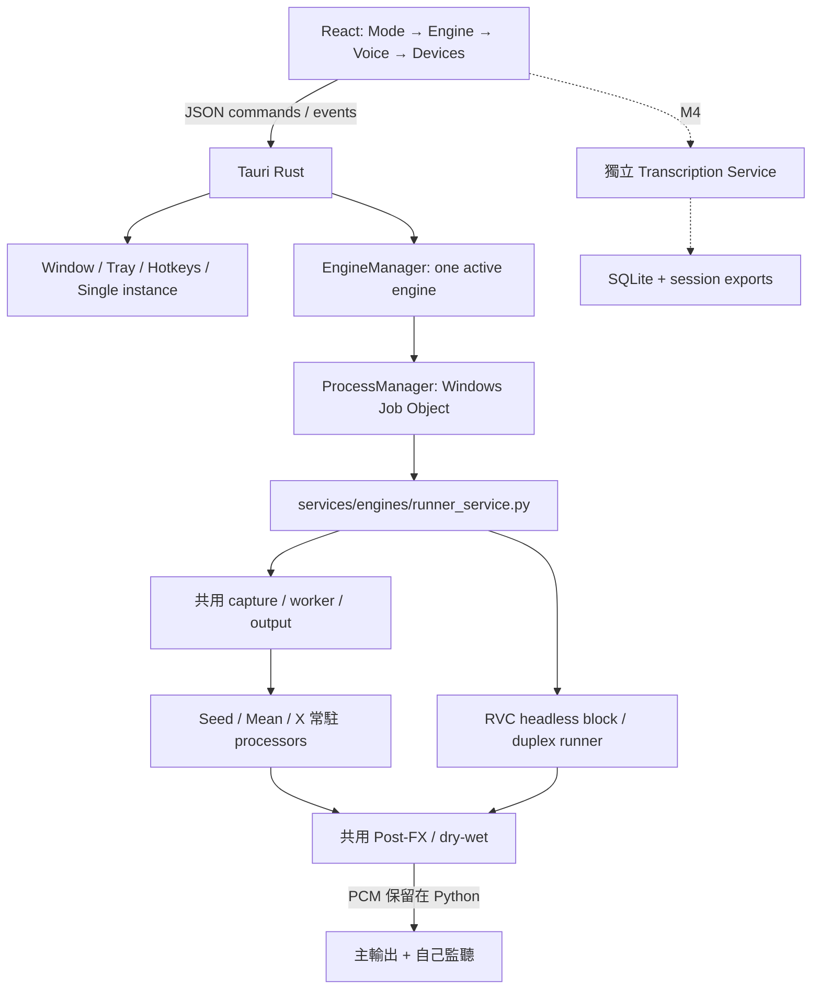
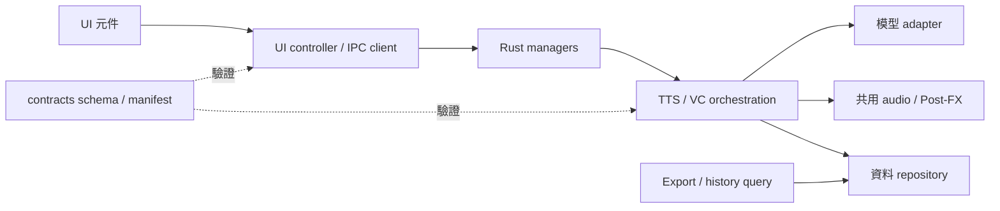

# AetherTune Desktop App — 架構與開發入口

**文件邊界：**本頁定義 Desktop React／Tauri／Python 的程式分層、資料所有權、程序生命週期與 IPC 設計，區分現況和目標。產品行為由 [app-requirements.md](app-requirements.md) 擁有；工作順序／狀態只在[任務進度](../status.md)；建置、測試與除錯命令由 [Agent 維護手冊](../../.agent/reference/agent-maintenance-guide.md) 擁有；真實結果見分項驗證。`backends/`、`tools/`、`models/`、`audio-rack/`、`benchmarks/` 保持各自責任。



## 責任與依賴

| 位置 | 責任 |
|---|---|
| `app/src/main.tsx`／`services/desktop.ts` | 三種 layout、capability filtering、明確的 pending UX、Tauri IPC |
| `app/src-tauri/src/main.rs` | 原生視窗、Tray、快捷鍵、single instance、commands、Exit |
| `app/src-tauri/src/engine_manager/` | discover／validate／start／stop／status／logs，串行切換 |
| `app/src-tauri/src/process_manager/` | suspended spawn → assign Job → resume；stdout／stderr；crash／cleanup |
| `services/engines/runner_service.py` | JSONL bridge、參數／reference／端點預檢、受限制的 runner argv |
| `services/engines/rvc_runtime.py` | 登錄 `.pth/.index`、固定 RVC core、CUDA F0 warmup、rolling buffer／SOLA、Mic／WAV、PortAudio 與監聽 |
| `services/engines/stream_runtime.py` | Seed／Mean／X 共用 capture callback、推論 worker、bounded PCM queue、輸出／監聽、metrics 與 evidence |
| `services/engines/streaming_adapters.py` | 三個常駐模型、reference conditioning、固定 source、48 kHz host block 與各自 rolling cache |
| `services/engines/postfx.py` | 四個 VC 共用 EQ／壓縮／殘響／乾濕混合；關閉時完整 bypass |
| `contracts/engines/` | 六個 manifest；VC 可啟動 Seed／Mean／X／RVC，TTS 另走 speech service |
| `contracts/schemas/` | manifest、state、Transcript、Session 的版本 1 契約 |

同一個 Python bridge 接各 VC Adapter；argv routing 受 engine allowlist 限制，模型用各自 venv。RVC 的 UI 參數從 manifest 呈現、JSON request 傳遞，runner 再驗範圍及 register hash。headless RVC 不啟動上游 GUI、不經 IPC 傳 PCM。

<a id="modular-boundaries"></a>
## 程式模組化：現況、目標與不可變條件

初始盤點為 2026-10-01 `60c1c89`；2026-10-02 已先抽出 TTS 快照投影。已有 UI service、Rust managers、Python adapter／playback／storage 分層，無須另造平台。以下區分現行責任與後續目標；執行狀態由 MOD-01～03、DATA-01、PERF-01～02 的[任務列](../status.md)維護，不能將局部抽離視為整體重構完成。

| 邊界 | 現況與待處理原因 | 目標責任／對外介面 |
|---|---|---|
| 畫面／UI controller | `main.tsx` 同時包含 layout、VC 設定、事件／polling、commands 與顯示；`SpeechWorkspace.tsx` 同時管草稿、訂閱、route、queue 操作及 JSX | 沿用 `components/` 與 `services/`；controller／hook 擁有訂閱與 actions，元件以 props／callbacks 呈現。layout 不建立第二套服務狀態 |
| IPC／原生 | `desktop.ts`／`speech.ts` 與 Rust managers 已作邊界 | IPC client 驗 payload／ACK，Rust 管 allowlist、互斥及 owned process；不把模型或 DB 規則搬進 UI／Rust command |
| TTS 協調 | `SpeechService` 仍做 validation、queue policy、狀態轉移、generation／playback 協調、persistence／evidence；公開 queue／request／profile 投影已交給 `services/tts/snapshot.py` | 保留既有 service 入口，逐步抽出 validation／queue policy／evidence；snapshot 模組只收資料、回傳深拷貝，service 擁有 lock／store／adapter，不反向依賴協調器 |
| VC runtime／模型 | 共用 capture worker 與三個模型 adapter 已分離，RVC 有獨立 block／duplex | callback 僅搬 PCM、推論在 worker；adapter 不決定 UI、Session 或資料清理策略；保留 backend venv 隔離 |
| 共用 Post-FX | `services/tts/postfx.py` 與 TTS service 直接依賴 `services/engines/postfx.py`，共用 DSP 的 owner 名稱仍屬 VC | 目標為 `services/audio/postfx.py` 的單一純 DSP owner；這是規劃路徑，尚未建立。VC／TTS 向共用層依賴，共用層不 import 任一 orchestration；不另複製算法 |
| 儲存／匯出 | `TranscriptStore` 同時管理 schema、query、settings、exports | 同一 canonical DB，由 repository 控制 transaction／schema；query 與 export 可拆成同目錄模組，export 只讀已提交資料，不自行更改 request／播放狀態 |
| 設定 | shell JSON、localStorage、sessionStorage 與 TTS DB 各保存部分內容 | 以既有領域提供 typed settings 介面及版本驗證；保留各 writer 邊界，不為「統一」直接搬空既有資料或複製一份全域設定 |

目標依賴方向（本圖含待重構的部分，不能當現況檔案圖）：



拆分必須保留：command ID／ACK 行為、request 提交快照、FIFO／取消、完成播放才寫 Transcript、cleanup 未確認時阻擋新音訊、Windows Job／WSL group 所有權、PCM 不經 IPC。檔案變短不等於解耦；驗收要看依賴方向、可注入邊界、故障影響範圍與行為回歸。

每次只抽一個責任，先維持舊公開入口與 payload；不在同一變更同時改 queue 語意、schema 與模型參數。舊 import 若有需要可短暫 re-export 同一實作，待 callers／tests／文件更新後移除，不長期保留兩份實作。source rollback 回退該變更；若有資料 migration，必須使用下節的資料復原流程，不能只回退程式。

<a id="data-ownership"></a>
## 資料模組化與生命週期

| 資料領域 | 現行權威／writer | 誰能讀／不變條件 | 後續補強 |
|---|---|---|---|
| Engine／Voice schema 與 catalogue | `contracts/engines/`、`contracts/voices/`、`contracts/schemas/`；受控 source 更新 | UI／service 讀取；service 仍需驗證輸入，不信任 UI 已驗 | schema 相容性與 catalogue reload 策略；不能修改 manifest 就宣稱 runner 支援 |
| 模型／reference 來源 | `models/`、`dataset/manifests/` registers；audit／register 工具 | adapters 解析路徑／hash；聲音檔不存 Git 或 SQLite blob | 匯入／替換時先驗來源、hash 及引用，舊 request 的 identity 不跟著改 |
| Session／request／Transcript | `artifacts/tts/tts.sqlite3`；`TranscriptStore` | 只有 service／repository 寫 DB；UI 經 query／IPC 讀，不直接 SQL | DB schema version、順序 migration、索引／分頁、備份／restore；目前 `_create_schema()` 建表不能取代版本遷移 |
| Recent／Favorites／TTS policy | 同一 SQLite 的專屬 tables；TTS settings／phrase methods | 與 session 資料分責任，跨 session 保留；不複製成 UI canonical list | typed API 與設定版本／invalid fallback，錯誤不得假回保存成功 |
| 語言／VC／六引擎音效偏好 | 各自 localStorage key；對應 UI settings service／目前 `main.tsx` | 只代表下一次操作偏好；已接受 request 用快照 | 集中各領域讀寫入口、key／version／default／migration 規則；不得用新 key 靜默丟棄舊偏好 |
| 原生外觀／快捷鍵 | `artifacts/desktop/shell.json`；Rust shell owner | UI 透過 IPC 更新；重啟不得恢復 click-through／quick popup | atomic 保存與版本檢查；註冊／保存失敗有復原，不混入 TTS DB writer |
| Composer／暫時 UI 選擇 | WebView sessionStorage；UI controller | 只是暫存，不保證跨 process 恢復；不能當 durable request | 明確的 reset／reload 範圍，layout／語言切換不破壞草稿 |
| Session exports | `artifacts/sessions/<id>/` JSON／JSONL／TXT；storage export | 由 DB 重建，不能反向自動覆蓋 DB；播放完成後 export 失敗不可重播 | 測量成本後再做有界／增量或 atomic export；提供重建及錯誤追蹤 |
| WAV／logs／evidence | 每次 request／run 的 runner／evidence writer | source／processed WAV 分開；同輪 hash／run identity 可追溯；DB 只放 metadata／path | 保留／清理策略與引用檢查；不得因 ignored、failed 或 cancelled 就任意刪除 |

目標 migration 流程：確認無 active writer → 使用能處理 SQLite WAL 的一致性備份（例如 SQLite backup API）→ 驗備份可開啟 → transaction 內逐版本升級 → 核對 row／identity／唯一約束 → 成功才更新版本。失敗 rollback；需要 restore 時先停止 writer，再還原已驗備份。直接複製正在寫入的單一 `.sqlite3` 檔不算有效備份。設定移轉也保留舊值及 failure evidence，不在失敗時寫回空白預設。

新 request 以提交時的 engine／profile／route／FX 為準；未完成 queue 在重啟後只能列為待處理紀錄，不自動恢復播放。UI Clear View、刪歷史、刪 WAV 是不同操作；資料刪除必須有範圍、引用檢查與使用者確認。新增 STT 沿用 Session／Transcript 契約與 repository，不另建無法關聯的 STT DB。

<a id="performance-design"></a>
## 效率優化的設計約束

- **模型生命週期：**保留同 engine 的 TTS resident worker 與 VC 常駐 processor；cold／warm／切換／取消後重新載入分開量測。不預載所有模型，不以延後取消或殘留 GPU worker 換取表面速度。
- **UI 更新：**目前 engine events 加 1 秒 refresh，SpeechWorkspace 也有訂閱及 native 1 秒 refresh；這是重複工作的待量測點，尚不能斷言瓶頸。若改成 event 為主、poll 為恢復，需 single-flight、失聯重同步及 unmount cleanup，不能漏掉終態。
- **Session 成長：**snapshot 以 current → pending → 其餘歷史的順序包含全部 requests；以 active ID set 篩選歷史，保留深拷貝及完整 profile／route。export 仍讀取本 session records 並重寫輸出。先測量資料量對 JSON、DB、I/O 與渲染的影響，再引入 bounded history／pagination 或增量 export；不能刪掉 canonical records 來縮短時間。
- **音訊熱路徑：**callback 不做 DB／磁碟／hash／log flush；bounded buffer、backlog、drops 保留。模型 p95、RTF 與 microphone→terminal 延遲是不同指標，不以增加未顯示的 buffer 掩蓋 underrun。
- **驗證：**固定輸入與硬體的 baseline／after、資源釋放、品質與耐久性條件見[優化驗收](verification-plan.md#optimization-acceptance)。沒有量測就只記「程式整理」，不記「效能提升」。

## 介面語言

`app/src/services/i18n.tsx` 提供 React context、語言選擇與 interpolation；`app/src/locales/messages.json` 是繁中／英文文案的唯一來源，每筆依序保存 `[zh-TW, en]`。原生系統匣由 Rust 編譯時包含同一 JSON，`set_ui_language` 僅接受 `zh-TW`／`en` 並更新既有選單 ID 的文案與 tooltip；不啟動、停止或重設音訊服務。

`aethertune.ui-language.v1` 保存獨立的顯示偏好，預設與無效值回到繁中。語言切換直接重繪元件、更新 HTML `lang`（`zh-Hant`／`en`），不 reload 或 remount 工作區；已產生的提示以 message key／參數呈現，使切換後同步更新。前端於啟動時讀取偏好並同步系統匣。保存與系統匣更新錯誤分開回報。

狀態代碼、engine/profile IDs、端點值與 IPC payload 不翻譯；內建參考聲音的顯示名稱與說明可翻譯，使用者文字與未知外部資料保留。後端原始紀錄／詳細錯誤保留供排錯。測試以穩定 `data-testid` 定位 controls，另以雙語可見文案與 aria label 驗證可及性。

## 程序與狀態語意

Rust 只啟動固定的 bridge 與既有 Python。前端不能指定 executable 或任意 shell command。bridge 的 request 寫入 ignored `artifacts/desktop/control/`；runner 結果進 `artifacts/desktop/runs/<uuid>/`。backend stdout／stderr 轉成 `log` events；每行立即 flush 到 `artifacts/desktop/logs/*.jsonl`，UI 僅保留最近 500 events。

Windows Job 開啟 `KILL_ON_JOB_CLOSE`；service 以 suspended 狀態建立，在 job 指派完成後 resume，衍生 PowerShell／venv launcher／Python 都繼承 job。Stop 先發 JSON command，最多等 3 秒，再 close Job、wait／join 所有 readers。service crash 自動 close Job；App Exit／硬結束由 Rust／OS close handle 清除子程序。只清理 App 自己擁有的 job，不依程序名稱掃殺既有 backend。

切換先 stop 舊 job，再啟動新 job，reader threads join 後才能復用 snapshot。UI 執行中鎖定 Engine 選擇；沒有無縫 hot swap。

`VALIDATING` = 資產、reference／WAV、參數、四引擎 PortAudio 端點與 Post-FX 預檢。預檢 PASS 不是 READY；`LOADING` = resident model 初始化與 warmup。模型完成預熱才 READY；真實 capture/output streams 開啟才 RUNNING。`vc_runtime`／`rvc_runtime` 由 bridge 轉成七狀態，不能用 PID 推論 RUNNING。`audio_verified` 固定 false，非零輸出與 physical listening／LIVE 驗收分開。

RVC 必須完成角色模型、HuBERT 及 FCPE／RMVPE CUDA warmup 才發 READY；WAV 處理／duplex stream 開啟後才發 RUNNING。Windows 阻塞 stdin 控制 reader 在 DLL 初始化後啟動，載入 watchdog 120 秒會保留堆疊並退出；載入中 Stop 由 bridge 的 2 秒 grace 與 Rust Job cleanup 回收。證據寫在 run 的 `rvc-evidence.json`，分別記錄模型／F0／HuBERT hash、device、block timing、callback／播放與監聽；不把這些升為 physical Mic 或 LIVE。

## 控制協定

App → bridge：

```jsonl
{"command":"start"}
{"command":"status"}
{"command":"set_parameter","name":"diffusion_steps","value":10}
{"command":"stop"}
```

非 runtime 可調參數回 `restart_required`。RVC 已提供 manifest 參數編輯，執行時鎖定，Stop 後重新啟動才套用。其他 VC 使用目前 defaults，完整通用編輯／Presets 留 M3。

bridge → App：state（嚴格七狀態）、validation、artifact、process_started、process_exit、log、error、restart_required、runtime、metrics。後兩者只傳 device／模型身分、音量、處理時間、RTF、backlog 與 drops；Rust 保存到 snapshot，UI 定時呈現。process_started 是程序事件，不是新的 BackendState；此通道不允許 PCM。

Seed／Mean／X 的 PortAudio callback 只搬運 PCM，模型由 worker 執行；input queue 有界，output queue 最多保留 500 ms。超量捨棄最舊樣本並明確計數，避免慢推論造成無限延遲。X-VC 等待真實 lookahead；Seed Desktop 沒有官方 GUI 的 VAD 靜音 gate。實測速度與缺口見 [Desktop VC 驗證](../verification/desktop/realtime-vc-verification-latest.md)。

## Overlay 與逃生入口

Full 1040 × 740、Compact 420 × 490、Mini 420 × 74，使用 logical pixel；Windows 125% DPI 的 physical size 相應放大。Compact／Mini 強制置頂；Full 可以自行選擇置頂。透明 WebView + Overlay CSS surface opacity 0.45–1；Full 維持不透明。標題以 pointer capture 取得 screen 座標差，再由 Rust `move_window` 套用 physical position；原生 drag region 在本機自動化測試未產生位移，因此使用此小型視窗控制替代。Lock Position 同時阻止前端 capture 與 Rust move／drag command；固定 frameless。

Click-through 只適用 Overlay；`Ctrl+Alt+A` 在 click-through 時解除並 show／focus，而非單純 hide。Tray 有 Disable click-through。重啟永遠清除 click-through，避免無法操控。快捷鍵修改先驗證、註冊失敗恢復舊值；外觀／hotkeys 保存 `artifacts/desktop/shell.json`。

瀏覽器預覽無原生能力，Start／Stop、Tray、native settings 按鈕明確停用。`npm run dev` 不是 Tauri 的音訊或程序驗收。

## 開發入口的設計界線

Windows WebView2、Rust MSVC／C++ Build Tools 與 Node/npm 是目前 Desktop build 的前置；模型／Python 仍按 backend 隔離。開發檔位於 `app/`，build/cache 與測試報告留在 ignored 目錄，不能由 exe 存在推論 portable installer 或音訊通過。具體建置、Browser／native 畫面測試與 cleanup 命令集中在[Agent 維護手冊](../../.agent/reference/agent-maintenance-guide.md)；本機啟動結果以[Desktop 驗證](../verification/desktop/app-verification-latest.md)及[Manual TTS 驗證](../verification/desktop/manual-tts-verification-latest.md)為準。

## 後續架構邊界

四個 VC 的 Desktop START 使用音訊 runtime；獨立 Seed 官方 GUI 仍由其 launcher 管理。通用引擎參數編輯／Preset、外部 VST Rack 與 physical／600 秒 LIVE 仍依各自契約擴充。

M4 的常駐 STT 不掛在 EngineManager job 下；Mic self 與 Remote loopback 分 source。重建使用 backend_stt provider 避免雙重辨識。SQLite transaction 在 completed utterance 後立即 commit，export 可由 canonical DB 重建；Clear View 不刪 DB。GPU 預設保留 VC，STT CPU。

M5 VoiceProfile 與 M6 TTS 共用 Mode → Engine；M7 只接既有 Audio Rack。M8 才處理 bundle resources、backend detection、installer／portable／auto update／startup／settings migration。任何超出此分層的改動先說明，不自行形成平行架構。

## Manual TTS 增量架構

以下只保留設計層的關係；修改步驟、probe 命令和錯誤分流集中在[Agent 維護手冊](../../.agent/reference/agent-maintenance-guide.md)。實測以[Manual TTS 驗證](../verification/desktop/manual-tts-verification-latest.md)為準。

新增服務留在 `services/tts/`，原生 bridge 留在 `app/src-tauri/src/speech_manager/`。`speech_status` 懶啟動受 Windows Job 管理的 Python JSONL service；`speech_action` 傳入 allowlist 動作，每次 command_id 都要收到 accepted／error ACK，拒絕新 request 不能被 UI 當成送出成功。IPC／WebView 仍不傳 PCM。

`SpeechRequest → SpeechQueue → TTSOrchestrator` 負責串行生命週期；Generation Adapter 為 CosyVoice2／Breeze 各自持有受 token 與 process group 管理的 WSL 常駐 worker，同一 Engine 的下一句重用模型。切換 Engine 先釋放舊 worker；生成中取消會終止該 worker，下一句重新載入；App Exit 清理 idle worker。每筆 request 仍有獨立 WAV、manifest 與 evidence。Playback 在 Windows 對指定 PortAudio output／host API 開啟音訊。內建 EQ／壓縮／殘響／dry-wet 使用共用 `services/engines/postfx.py`；TTS 由 `services/tts/postfx.py` 以固定 block 處理完整生成 WAV，保留原始檔，主輸出與監聽播放同一份結果。現有 `seed-vc-virtual-route` 與 `seed-vc-neutral` 是跨 backend 共用外部 rack／route，不能將 playback completion 等同完整 rack／LIVE PASS。

`AudioEffectsSettings` 是唯一的音效編輯位置；`audio-effects.ts` 以 `aethertune.audio-effects.v1` 持久保存六引擎的獨立紀錄，current engine 決定 START／submit 使用的設定，避免切換時將前一引擎狀態覆寫給後一引擎。舊共用 VC 設定只移轉到 RVC。TTS `metadata.postfx` 於服務端校驗並深拷貝入 queue record，處理後路徑、hash 與時間另寫 evidence／metrics；已接受 request 不讀目前 UI 設定。

SpeechManager 與 VC EngineManager 分開持有程序，Audio control mutex 防止兩邊同時提交佔用 Output 的啟動動作。Stop Speaking 送 TTS command，不關閉 TTS service；App Exit 才送 shutdown 並釋放 Job。WSL generation 的取消另外要清除自己建立的 Linux process group；Windows Job 不能當成 Linux 子程序已消失的證據。

Session、request history、成功 Transcript 與 phrase settings 由 SQLite 保存；每個成功播放事件立即 commit，session exports 由 canonical records 寫出。Voice profiles 將已使用的 reference 音訊／文字包成 catalogue，保留 draft／授權限制，不冒充已有人類採納的 Voice Library。

現有 adapter 的輸出是完整 WAV，`supports_streaming_tts=false`；Generation 與 Playback 保留分層及 chunk extension。AgentReplyProvider／AgentReply 僅契約，agent_reply input 與 agent source 提交均停用。

無視窗正式 manager probe 與實際 CABLE 擷取的命令、輸入和限制由[Agent 維護手冊](../../.agent/reference/agent-maintenance-guide.md)與[Manual TTS 驗證](../verification/desktop/manual-tts-verification-latest.md)擁有，不在架構文件複製。
